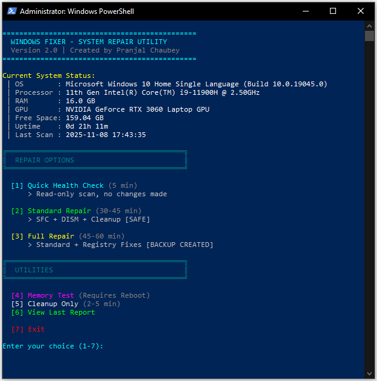

# Windows Fixer 🔧

**One-Click Windows System Repair & Health Check Utility**

Windows Fixer is a powerful yet safe PowerShell script that automates common Windows troubleshooting tasks. It features an **interactive menu system** for easy navigation, fixes system corruption, cleans junk files, checks your disk health, and generates a beautiful, easy-to-read report—all with a single click. No technical knowledge required!



---

## ✨ New in Version 2.0

- 🎨 **Interactive Menu System** - Beautiful visual interface with no command-line knowledge needed
- 💻 **Real-Time System Status** - View CPU, RAM, GPU, disk space, and uptime at startup
- 🔍 **Quick Health Check Mode** - Fast 5-minute scan without time-consuming repairs
- 🗑️ **Cleanup-Only Mode** - Free up disk space without running full repairs
- 📊 **Quick Report Access** - Instantly view your last scan results
- 🎯 **Smart Post-Execution Menu** - Choose what to do after repairs complete
- 🔄 **Auto-Cleanup** - Automatically removes reports older than 7 days

---

## What Does Windows Fixer Do?

Windows Fixer performs these operations automatically:

| Feature | What It Fixes | Time Required |
|---------|---------------|---------------|
| **Quick Health Check** | Read-only system scan | 5 minutes |
| **SFC Scan** | Corrupt system files | 15-30 minutes |
| **DISM Repair** | Broken Windows image | 20-40 minutes |
| **Disk Health Check** | Failing hard drive/SSD | 1 minute |
| **Temp File Cleanup** | Junk files taking up space | 2-5 minutes |
| **Memory Test** | Detect bad RAM modules | Requires reboot |
| **Registry Fixes** | WMI, Windows Update, Network issues | 5-10 minutes (optional) |


---

## 🛡️ Safety First

Windows Fixer is designed to be **safer than manual repairs**:

- ✅ **Creates restore points** before making changes
- ✅ **Backs up registry** automatically  
- ✅ **Uses only Microsoft-approved commands**
- ✅ **Opt-in for registry changes** — will not touch registry unless you ask

---

## Prerequisites

**What you need:**
- Windows 10 or Windows 11 (64-bit)
- Administrator access to your computer
- At least 5 GB of free space on C: drive
- Internet connection (recommended for DISM repair)

---

## Installation (3 Steps)

### Step 1: Download the Script

Download **`WindowsFixer.ps1`** from the GitHub repository:
- Click the green "Code" button → "Download ZIP"
- Extract the ZIP file to your **Desktop** 

**Result:** You should see the `Windows-Fixer` folder on your Desktop with `WindowsFixer.ps1` inside the `src` folder.

---

### Step 2: Allow PowerShell Scripts (One-Time Setup)

Windows blocks scripts by default for security. Let's allow this one:

1. **Right-click the Start button** → Select **"Windows PowerShell (Admin)"** or **"Windows Terminal (Admin)"**
2. Copy this command:
   ```powershell
   Set-ExecutionPolicy -ExecutionPolicy RemoteSigned -Scope CurrentUser -Force
   ```
3. Right-click in the PowerShell window to paste, then press Enter

**What this does:** Allows you to run local scripts like Windows Fixer while still blocking malicious ones from the internet.

---

## How to Use Windows Fixer

### � Simple Method (Recommended)

1. Navigate to `Desktop\Windows-Fixer\src\` (or `OneDrive\Desktop\Windows-Fixer\src\` if using OneDrive)
2. **Right-click** `WindowsFixer.ps1`
3. Select **"Run with PowerShell"**
4. Click **"Yes"** when User Account Control asks for administrator permission
5. The interactive menu will appear automatically

**That's it!** No shortcuts, no command-line knowledge needed. Just right-click and run.

---

### 🎨 Interactive Menu Mode

Once you run the script, you'll see a clean menu with real-time system information:

```
==============================================
  WINDOWS FIXER - SYSTEM REPAIR UTILITY
  Version 2.0 | Created by Pranjal Chaubey
==============================================

Current System Status:
 │ OS        : Windows 11 Pro (Build 10.0.22631.0)
 │ Processor : AMD Ryzen 7 5800H with Radeon Graphics
 │ RAM       : 16.0 GB
 │ GPU       : NVIDIA GeForce RTX 3060 Laptop GPU
 │ Free Space: 165.18 GB
 │ Uptime    : 2d 5h 32m
 │ Last Scan : 2025-11-07 23:27:35

╔══════════════════════════════════════════╗
║  REPAIR OPTIONS                          ║
╚══════════════════════════════════════════╝

  [1] Quick Health Check (5 min)
      > Read-only scan, no changes made

  [2] Standard Repair (30-45 min)
      > SFC + DISM + Cleanup [SAFE]

  [3] Full Repair (45-60 min)
      > Standard + Registry Fixes [BACKUP CREATED]

╔══════════════════════════════════════════╗
║  UTILITIES                               ║
╚══════════════════════════════════════════╝

  [4] Memory Test (Requires Reboot)
  [5] Cleanup Only (2-5 min)
  [6] View Last Report

  [7] Exit

Enter your choice (1-7):
```

---

### 💻 Command-Line Mode (For Automation & Power Users)

#### Standard Repair (Default)
```powershell
& "$env:USERPROFILE\Desktop\Windows-Fixer\src\WindowsFixer.ps1" -SkipMenu
```

#### Full Repair (With Registry Fixes)
```powershell
& "$env:USERPROFILE\Desktop\Windows-Fixer\src\WindowsFixer.ps1" -SkipMenu -IncludeRegistryFixes
```

#### Unattended Mode (Full + Auto Memory Test)
⚠️ **Only use this when you're ready to reboot!**
```powershell
& "$env:USERPROFILE\Desktop\Windows-Fixer\src\WindowsFixer.ps1" -SkipMenu -IncludeRegistryFixes -AutoMemoryTest:$true
```

*Note: If using OneDrive, replace `Desktop` with `OneDrive\Desktop` in all commands.*
*Note: Quick Health Check is only available through the interactive menu (no `-SkipMenu` flag).*

---

## Understanding Your Report

After running Windows Fixer, you'll see an HTML report with comprehensive results:

### Executive Summary

At the top, you'll see a quick checklist:

- ✅ **Green** = Good/Was Fixed
- ⚠️ **Yellow** = Warning/Attention Needed
- ❌ **Red** = Error/Requires Manual Action

### Key Sections Explained

#### 0. System Information (New!)
- OS version, build, and uptime
- Last scan timestamp
- System specifications

#### 1. Preflight Checks
- **Pending Reboot:** If "True," restart needed before fixes work properly
- **Free Space:** Should be >10 GB. Low space causes wonky behavior

#### 2. SFC Scans (System File Checker)
Shows if corrupt Windows files were found and repaired. Run twice for thoroughness.
*Note: Skipped in Quick Health Check mode.*

#### 3. DISM Restore Health
Repairs the Windows image itself. If this fails, you may need installation media.
*Note: Skipped in Quick Health Check mode.*

#### 4. Disk Health Analysis
- **WMIC Status:** Should say "OK" for all drives
- **SMART Details:** If "Predict Failure" is True, backup immediately—drive is dying

#### 5. Critical Events
Lists recent system errors. More than 10 in 7 days indicates deeper issues.

#### 6. Cleanup Summary
Shows how many GB of junk files were removed.

#### 7. Registry Repairs (If Enabled)
Shows what registry fixes were applied. Always creates restore point first.

#### 8. Registry Health Scan (Read-Only)
Lists orphaned apps and startup programs. Review before manually deleting.

---

## Menu Options Explained

### 🔍 Quick Health Check (Option 1)
**Duration:** ~5 minutes  
**What it does:**
- ✅ System status check
- ✅ Disk health + SMART data
- ✅ Event log analysis
- ✅ Registry health scan (read-only)
- ✅ Temp file cleanup
- ❌ Skips SFC/DISM (saves 35-70 minutes)

**Use when:** You want to check if there are issues without waiting for long repairs.

---

### 🛠️ Standard Repair (Option 2)
**Duration:** ~30-45 minutes  
**What it does:**
- ✅ Everything from Quick Health Check
- ✅ SFC scan (2 passes)
- ✅ DISM image repair
- ✅ DISM component cleanup
- ❌ No registry modifications

**Use when:** Windows feels broken, or you have update/corruption issues.

---

### 🔧 Full Repair (Option 3)
**Duration:** ~45-60 minutes  
**What it does:**
- ✅ Everything from Standard Repair
- ✅ WMI repository reset (if corrupted)
- ✅ Windows Update component reset
- ✅ Network stack reset (Winsock/TCP-IP)
- ✅ Font cache rebuild
- ✅ Creates restore point + registry backups

**Use when:** You have persistent issues with updates, network, or system services.

---

### 💾 Memory Test (Option 4)
**Duration:** 10-30 minutes (after reboot)  
**What it does:**
- Launches Windows Memory Diagnostic tool
- Prompts you to restart manually to run the test
- Tests RAM for defects and errors

**Use when:** You suspect RAM issues (random crashes, blue screens, system instability).

**Note:** The tool will open and ask you to restart. You can also use the post-execution menu's "Reboot Now" option after viewing your report.

---

### 🗑️ Cleanup Only (Option 5)
**Duration:** ~2-5 minutes  
**What it does:**
- ✅ Removes temp files (User + System + CBS logs)
- ✅ DISM component cleanup
- ✅ Shows space recovered
- ❌ No repairs or scans

**Use when:** You just need to free up disk space quickly.

---

### 📊 View Last Report (Option 6)
**What it does:**
- Opens the most recent HTML report in your browser
- Shows error if no previous reports exist

**Use when:** You want to review results from a previous run.

---

## File Locations

### Reports & Logs
All files are saved to:
```
C:\Users\YourName\OneDrive\Documents\WindowsFixer\
```
or (if OneDrive is disabled):
```
C:\Users\YourName\Documents\WindowsFixer\
```

**Files created:**
- `WindowsFixer_Report_[timestamp].html` - Detailed HTML report
- `WindowsFixer_Log_[timestamp].txt` - PowerShell transcript log
- `RegistryBackup_[timestamp]\` - Registry backups (only with Full Repair)

**Automatic Cleanup:**  
Files older than **7 days** are automatically deleted on each run to save disk space.

---

## Troubleshooting

### Problem: "Script cannot be loaded because running scripts is disabled"
**Solution:** Run Step 2 again (Command: `Set-ExecutionPolicy -ExecutionPolicy RemoteSigned -Scope CurrentUser -Force`).

### Problem: "Access denied" or "Administrator rights required"
**Solution:** Make sure you right-click the script and select **"Run with PowerShell"**. Windows will automatically prompt for administrator permission (UAC). Click "Yes" when prompted.

### Problem: Script window appears briefly then disappears
**Solution:** The script detected it wasn't running as administrator and tried to restart elevated. Make sure you're using the right-click method described above. If the issue persists, temporarily add `-NoExit` flag to test (see Power Users section).

### Problem: Menu doesn't appear, script runs directly
**Solution:** You're using command-line flags. Remove `-SkipMenu`, `-IncludeRegistryFixes`, and `-AutoMemoryTest` parameters to see the interactive menu.

### Problem: DISM fails with "Error: 0x800f081f"
**Solution:** You need Windows installation media for repair. This is rare and indicates deep system damage. Contact support or consider a clean Windows reinstall.

### Problem: Report doesn't open automatically
**Solution:** Find it manually in your Documents folder:
```
Documents\WindowsFixer\WindowsFixer_Report_[date]_[time].html
```
Or use **Menu Option [6]** to quickly open the last report.

### Problem: System seems slower after running
**Solution:** This is normal for the first 5-10 minutes. Windows is rebuilding indexes and caches. Restart if it persists beyond that.

---

## Frequently Asked Questions

### Q: Is this safe? Will I lose my files?
**A:** Yes, it's safe! Windows Fixer only repairs system components and cleans temporary files. Your documents, photos, and programs are never touched.

### Q: How often should I run this?
**A:** Run it when your system feels "wonky"—slowdowns, glitches, or weird errors. As preventive maintenance, once per month is fine. Use Quick Health Check for regular check-ups.

### Q: Can I use my computer while it runs?
**A:** Light use (web browsing) is okay, but avoid heavy tasks like gaming or video editing. The script needs full system access.

### Q: What if something goes wrong?
**A:** Windows Fixer creates a system restore point before changes. To undo:
1. Press `Win + R` → Type `rstrui` → Press Enter
2. Select the restore point named "Windows Fixer - Registry Repairs"
3. Follow the wizard to restore

### Q: Do old reports get cleaned up automatically?
**A:** Yes! Version 2.0 automatically deletes reports older than 7 days to save disk space. You always keep the last week of history.

### Q: Does this work with OneDrive?
**A:** Yes! Version 2.0 automatically detects OneDrive Documents folder and saves reports there if OneDrive is enabled.

### Q: Do I need to pay for this?
**A:** No! Windows Fixer is completely free and open-source.

### Q: Will this work on Windows 7/8?
**A:** No. Windows Fixer is designed for Windows 10 and 11 only.

---

## Uninstalling / Cleanup

Windows Fixer doesn't install anything, so removal is simple:

1. Delete the `Windows-Fixer` folder from your Desktop (or OneDrive\Desktop)
2. Delete the `Documents\WindowsFixer` or `OneDrive\Documents\WindowsFixer` folder (contains reports and logs)
3. (Optional) Revert the execution policy:
   ```powershell
   Set-ExecutionPolicy -ExecutionPolicy Restricted -Scope CurrentUser -Force
   ```

**That's it!** No registry entries, no system files modified.

---

## Support & Contributing

- **Found a bug?** Open an issue on GitHub:  
  https://github.com/pranjalchaubey/Windows-Fixer/issues
- **Want to improve?** Submit a pull request!
- **Questions?** Discussions are open on GitHub.

---

## License

This project is licensed under the MIT License. See LICENSE file for details.

**Disclaimer:** This tool is provided as-is. While thoroughly tested, use at your own risk. Always maintain backups of important data.

---

<div align="center">

⭐ **If Windows Fixer helped you, please star the repository!** ⭐

</div>

---

## Repository Structure

```
Windows-Fixer/
├── src/
│   └── WindowsFixer.ps1      # Main script
├── README.md                 # This file
├── LICENSE                   # MIT License
└── assets/
    └── app-screenshot.png    # Screenshots
    └── sample-report.html    # Sample HTML Report
```

---

## Changelog

### Version 2.0 (November 2025)
**Major Features:**
- ✨ Interactive menu system with ASCII box-drawing characters (compatible with all PowerShell versions)
- 💻 Real-time system status display (CPU, RAM, GPU, disk, uptime, last scan)
- 🔍 Quick Health Check mode (5-minute read-only scan, skips SFC/DISM)
- 🗑️ Cleanup-Only mode for quick disk space recovery
- 📊 Quick access to view last report (Menu Option 6)
- 🎯 Smart post-execution menu (view report, reboot, return to menu, exit)
- 🔄 Automatic cleanup of reports older than 7 days
- ☁️ Automatic OneDrive Documents path detection

**Bug Fixes:**
- 🐛 Fixed Windows Update reset error with existing backup folders
- 🐛 Fixed PowerShell 5.1 compatibility (removed Get-Uptime cmdlet, manual calculation)
- 🐛 Fixed pending reboot check syntax errors
- 🐛 Fixed WMI health check pipeline parameter issue
- 🐛 Fixed WMIC diskdrive command (removed spaces after commas)
- 🐛 Fixed Unicode emoji rendering issues (replaced with ASCII characters)
- 🐛 Removed desktop shortcut creation for Memory Test (caused errors)

**Improvements:**
- 🎨 Memory Test simplified (no auto-reboot, use post-execution menu instead)
- 🎨 Memory Diagnostic only runs for Standard/Full/Memory Test modes (skipped in Quick Check)
- 🎨 Changed "Blue" text colors to "Cyan" for better readability on blue PowerShell background
- 🎨 Enhanced error messages and user feedback throughout
- 📖 Simplified installation (right-click to run, no shortcuts needed)

### Version 1.0 (Initial Release)
- Basic SFC, DISM, disk health, and registry repair functionality
- HTML report generation
- Command-line flag support

